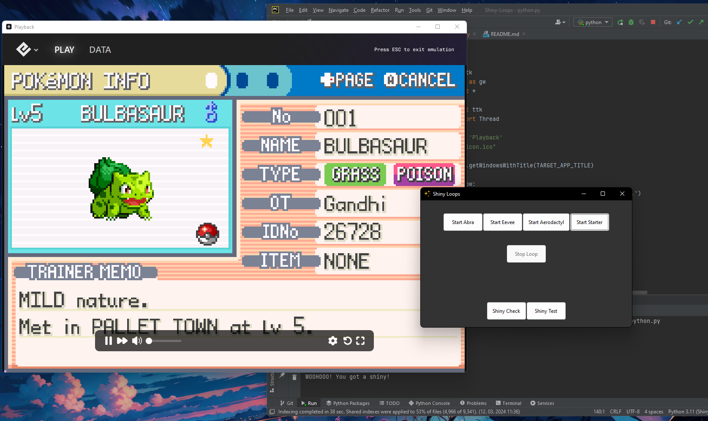
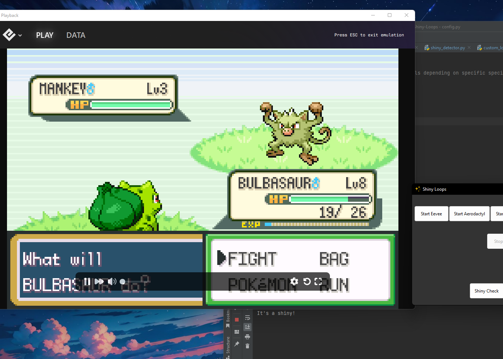
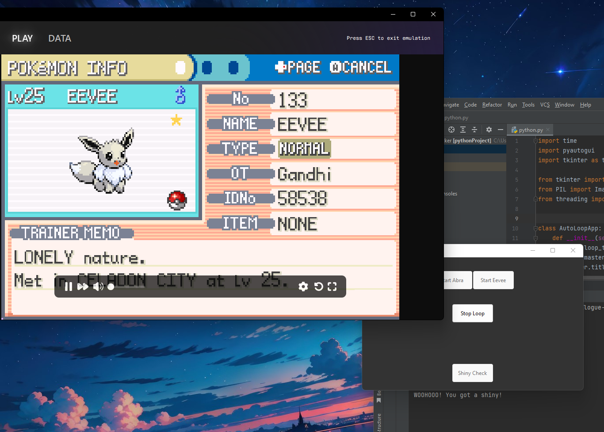

# Shiny-Loops
Shiny hunting bot for Epilogue (Still a work in progress, some hunts may
work better than others)


## How it works
- The application uses libraries which allow keyboard input
 calls to the Playback app, allowing the bot to use the button combinations
 to shiny hunt instead of you.
- It can either soft reset for shinies, for example starters, eevee, fossils,...
 Or it can run around the grass/water and do random encounters for you.
- As soon as a shiny appears on your screen, the screen capturing function will
detect it and stop the loop. For example, if one were to leave the bot running overnight
 and a shiny would appear while not attending to the bot, it would just stop the loop
and the shiny would be waiting in the morning.
- Even if the computer would shut down or crash, Epilogue Playback offers an automatic
save state, so if the shiny was found before the crash, it would still be recoverable by loading
the last save state.

## Installation Guide

### Prerequisites

Before you begin, ensure you have the following:

- **Python**: Ensure Python 3 is installed on your system (I am using 3.11). You can download it from the [official Python Website](https://www.python.org/downloads/).
- **IDE**: IDE of your choice, I use PyCharm on Windows(For free version download Community Edition) [Pycharm Download](https://www.jetbrains.com/pycharm/download/?section=windows).
- **Epilogue Playback**: This application is required for the proper functioning of this code. Download and install it from [Epilogue’s Official Site](https://www.epilogue.co/downloads).

### Setting Up the Project

#### 1. Download the Project

- Click the green "Code" button.
- Select "Download ZIP" and save the file to your computer.
- Extract the ZIP file to a directory of your choice.

### 2.1 Run the Project

- Open your IDE and setup the environment
- In the terminal of your IDE, run the following command:

  ```bash
  pip install -r requirements.txt

#### 2.2 Common errors

- If there are issues with permision use this:

  ```bash
  pip install --user -r requirements.txt

- If you get the following error:

  ```bash
   ImportError: No module named win32con
  
- Use this commad

  ```bash
  pip install pypiwin32
  
- Open Playback
- Run shiny_loops.py and proceed with the "How to use" below

## How to use
- Put Epilogue Playback in the top left corner of your screen (be sure the game is at least half visible,
so that the screen capture app can spot the shiny)

- Save in front of desired hunt (For soft resets be sure to only have 1 Pokémon in your party, as it will
always check your second Pokémon for shininess)

- Change speed up setting in Playback to 5x

- Click on the hunt you want to do

- Watch the bot do the work for you


## Useful advice
- If you already have a shiny you can use the shiny check and shiny test buttons, 
this will allow you to verify whether the shiny detection program works as intended.


- Using high intensity programs alongside Shiny Loops may not work as smoothly as intended
because of epilogue lag

- If a loop would not go as intended because of the lag of the emulator, there is no need to worry,
since the loop will fix itself on the next iteration or two.

## Proof of work
Pictures taken from a couple successful hunts during the creation and testing of the program






## Interesting Stats
Some hunts go faster than others, but here are the stats for how many encounters one would
get using Shiny Loops on wild encounters:

- 1 hour ~ 300 en
- 1 day ~ 7200 en
- 1 week ~ 50400 en

Knowing that a shiny is ~ 1/8000, it means that leaving the bot on for a week would, on average,
find you 6 shinies (catching not included :P)

## Contributing
All contributions are welcome, even if just a feature recommendation or a small bug fix. 
